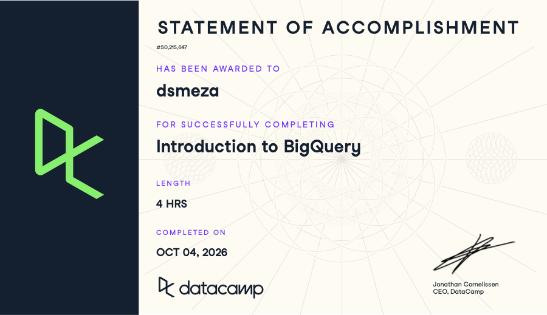

**Course:** IBM 6500 — MSDM Culminating Experience Project **Assignment:** SQL2 – Introduction to BigQuery (DataCamp)

## Course-Completion Evidence

{width="515"}\
I completed the Introduction to BigQuery course on DataCamp on OCTOBER 4, 2026.

## Learning Notes and Key Takeaways

### Chapter 1: BigQuery Architecture and Structure

**Main ideas:** This chapter covers what makes BigQuery different from a traditional database: it's a serverless, fully-managed cloud data warehouse built for large-scale analytical (read-heavy) queries rather than frequent small transactions. Where a traditional SQL database is typically row-oriented and optimized for transactional workloads (inserting/updating individual records), BigQuery is column-oriented, which lets it scan only the specific columns a query actually needs instead of reading whole rows — this is what makes it so much faster at scanning massive datasets for analysis.

**BigQuery terminology or procedures:** BigQuery's architecture separates storage and compute into distinct components that work together:

- *Column-oriented storage* — data is stored by column rather than by row, speeding up read-intensive analytical queries.
- *Capacitor format* — BigQuery's internal storage format; efficiently stores semi-structured data, including nested fields.
- *Colossus file system* — Google's distributed storage layer; manages data replication and recovery for reliability.
- *Jupiter network* — the high-speed network that moves data between storage (Colossus) and compute.
- *Dremel engine* — the query execution engine; runs queries through a tree structure (root node → mixers → leaf nodes) so work can happen in parallel.
- *Borg system* — Google's cluster manager; allocates compute resources and handles failures behind the scenes.

Query flow through these pieces looks like: **Root Node → Mixers → Leaf Nodes → Colossus → Aggregation**.

Data itself is organized in a three-level hierarchy:

- **Project** — the top-level container; manages users, permissions, and billing.
- **Dataset** — acts like a schema; contains tables and has its own permission settings.
- **Table** — where the actual data rows live.

BigQuery also operates across specific Google Cloud regions, with rules about where data is stored and whether/how it can move between regions.

**Important SQL syntax:** Fully qualified table references use backticks around the three-part path: `` `project_id.dataset_id.table_id` ``.

``` sql
SELECT *
FROM `project_id.dataset_id.table_id`
```

**Explanation:** This query pulls every column and row from a specific table, referenced by its full three-part path — which Google Cloud project it lives in, which dataset (schema) within that project, and which table within that dataset. The backticks are required because the path contains periods, which would otherwise be misread as part of the identifier syntax.

**CEP application:** The project → dataset → table hierarchy matters directly for the CEP: if Farm Store data from Clover or GA4 eventually gets loaded into BigQuery, I'll need to know exactly which project and dataset to point to in order to pull the right table — that's the foundation for every query I'd write against it. The column-oriented, Dremel-based architecture also explains why BigQuery is well suited to the kind of large-scale, read-heavy analysis AO1 and AO2 need (aggregating months of transaction or GA4 event data), compared to a transactional database built for processing individual orders one at a time.

### Chapter 2: Writing Queries and Data Types

**Main ideas:** This chapter moves from BigQuery's architecture into actually writing queries. BigQuery uses GoogleSQL, a SQL dialect that will feel familiar if you know standard SQL but has some of its own functions and data types. The chapter covers three things: writing core queries (joins, grouping, aggregation) against a sample e-commerce dataset, the different ways to get bulk data into BigQuery, and the data types BigQuery supports — including date/time types and more flexible, "unstructured" types for data that doesn't fit neatly into rows and columns.

**BigQuery terminology or procedures:** Key pieces from this chapter:

- *GoogleSQL* — BigQuery's SQL dialect; standard SQL concepts (joins, `GROUP BY`, aggregation) carry over directly.
- *Data ingestion methods* — three main ways to load bulk data into BigQuery: through the BigQuery Studio UI (uploading files from your computer or Google Cloud Storage), the `bq` command-line tool (more control/flexibility), or the `LOAD DATA` SQL statement (loads directly from Google Cloud Storage).
- *Date/time data types* — `DATE`, `TIMESTAMP`, `DATETIME`, and `TIME`, each used for filtering, extracting components, and partitioning tables by date.
- *ARRAY* — an ordered list of values within a single field (similar to a Python list); accessed with bracket notation or functions like `ARRAY_LENGTH`.
- *STRUCT* — a field that holds nested key-value data (similar to a Python dictionary or a JSON object).
- *UNNEST* — converts an `ARRAY` into individual rows so its contents can be queried normally.
- *SEARCH* — a function for querying unstructured/text data for specific terms.

**Important SQL syntax:**

``` sql
SELECT customer_id, COUNT(order_id) AS order_count
FROM order_details
JOIN orders USING(order_id)
GROUP BY customer_id;
```

Other syntax introduced: `LOAD DATA INTO dataset.table FROM FILES(...)`, `TIMESTAMP_ADD`/`TIMESTAMP_SUB`, `DATE_ADD`/`DATE_SUB`, `EXTRACT`, and array indexing like `my_array[1]`.

**Explanation:** The example query joins the `order_details` and `orders` tables on `order_id`, then groups the combined results by `customer_id` and counts how many orders each customer has placed, labeling that count `order_count`. This is a standard pattern for turning transaction-level data into a per-customer summary metric.

**CEP application:** This chapter is directly usable for AO1 and AO2 — a join-and-count query like the example is essentially the structure I'd use to count orders per Farm Store customer from Clover transaction data, or to summarize category/SKU-level order counts for AO2's assortment analysis. The date/time functions matter for AO4 specifically, since GA4 conversion-path data is timestamp-heavy and I'll need `EXTRACT`/`TIMESTAMP` functions to analyze traffic and conversions by day or week. The ARRAY/STRUCT/`UNNEST` concepts are especially relevant because GA4's BigQuery export format stores event data in nested STRUCTs and ARRAYs (e.g., event parameters, item lists within a purchase event) — understanding `UNNEST` now will be necessary groundwork for actually querying GA4 export data for AO4 later in the project.

### Chapter 3: Aggregation, CTEs, and Window Functions

**Main ideas:** This chapter is about summarizing and restructuring data so complex questions can be answered in readable, maintainable queries. It covers four connected ideas: Common Table Expressions (CTEs), which break a complicated query into named, temporary steps; standard aggregation functions for summarizing groups of rows; BigQuery's special aggregate functions (including approximate versions built for very large datasets); and window functions, which calculate values like rankings and running comparisons across related rows without collapsing them into a single summary row.

**BigQuery terminology or procedures:** Key pieces from this chapter:

- *CTE (Common Table Expression)* — a temporary, named result set created with a `WITH` clause that exists only for the duration of the query. It's easier to read and maintain than nesting subqueries, and multiple CTEs can be chained to build up a complicated query one step at a time.
- *Aggregation functions* — `COUNT`, `SUM`, `AVG`, `MIN`, and `MAX` summarize groups of rows, organized with `GROUP BY` and sorted with `ORDER BY`. `COUNTIF` counts only rows meeting a condition, `HAVING` filters *after* aggregation (whereas `WHERE` filters before), and `ANY_VALUE` returns an arbitrary value from a group.
- *BigQuery-specific aggregates* — `STRING_AGG` joins strings into one value using a delimiter, `ARRAY_CONCAT_AGG` merges multiple arrays into one, the approximate functions (e.g., approximate distinct counts, quantiles, top elements) trade a small amount of precision for speed on huge datasets, and logical aggregates evaluate boolean conditions across a group.
- *Window functions* — calculate across a set of related rows (the "window") defined by `OVER (PARTITION BY ... ORDER BY ...)` while keeping every individual row in the output. `RANK` ranks rows within a partition, `LAG`/`LEAD` read the previous/next row's value, `RANGE BETWEEN` defines flexible window frames (like running totals), and `QUALIFY` filters the results of window functions (similar to how `HAVING` filters aggregates).

**Important SQL syntax:**

``` sql
WITH category_sales AS (
  SELECT category, SUM(sales) AS total_sales
  FROM sales_data
  GROUP BY category
)
SELECT category, total_sales,
       RANK() OVER (ORDER BY total_sales DESC) AS sales_rank
FROM category_sales;
```

In this example, `sales_data` is a placeholder table of sales records, `category` is the product category column, and `sales` is the numeric sales amount for each record. Other syntax introduced: `COUNTIF(condition)`, `HAVING`, `STRING_AGG(column, ', ')`, `LAG(column) OVER (...)`, `LEAD(column) OVER (...)`, and `QUALIFY`.

**Explanation:** The `WITH` clause first creates a temporary result called `category_sales` that totals sales for each category. The main query then reads from that CTE and uses the `RANK()` window function to assign each category a rank by total sales, highest first. Splitting the logic into two steps makes it much easier to read than a single nested query, and the window function ranks every category without collapsing the rows.

**CEP application:** This chapter maps closely onto my AO2 work. A CTE that totals Clover sales by category or SKU, followed by a `RANK()` window function, is essentially the query pattern for identifying top- and bottom-performing categories and SKUs. `LAG`/`LEAD` could compare each period's sales to the previous one to spot demand trends, and `COUNTIF` could count transactions or inventory records that meet a condition, such as items at or below a stockout threshold. For AO1 and AO4, aggregations such as `COUNT` and `SUM` with `GROUP BY` would summarize online orders and conversion events by channel or date, and `QUALIFY` would help me keep only the top-ranked results within each group when analyzing GA4 traffic sources.

### Chapter 4: Data Management and Optimization

**Main ideas:** This final chapter covers three skills that turn BigQuery from a place you read data into a place you build reports and manage data. First, joins combine tables so related information (such as customers and their orders) can be analyzed together. Second, DML (Data Manipulation Language) statements let you add, change, and remove records and create new tables from query results. Third, query optimization is about writing queries that return the same answer while processing less data, which matters because BigQuery handles very large datasets. The chapter closes by tying together everything from the course: architecture, ingestion and data types, CTEs, aggregations, window functions, joins, DML, and optimization.

**BigQuery terminology or procedures:** Key pieces from this chapter:

- *Join types* — an `INNER JOIN` returns only rows with matches in both tables; a `LEFT JOIN` keeps every row from the left table even without a match; a `RIGHT JOIN` keeps every row from the right table; a `FULL JOIN` keeps all rows from both sides; and a `CROSS JOIN` pairs every row of one table with every row of the other.
- *DML statements* — `INSERT` adds new records, `UPDATE` changes existing records based on a condition, `DELETE` permanently removes records, `MERGE` combines insert, update, and delete logic in a single statement, and `CREATE TABLE AS` builds a new table from the results of a query.
- *Query optimization strategies* — three themes: reduce the data (select only the columns you need and filter early, including inside CTEs), optimize operations (apply `WHERE` filters early and use efficient data types such as `INTEGER`), and reduce the output (limit the data going into `JOIN`s and avoid expensive `ORDER BY` operations inside CTEs).
- *EXISTS vs. COUNT* — when you only need to know whether a record exists, `EXISTS` can be more efficient than counting every matching row.

**Important SQL syntax:**

``` sql
SELECT c.customer_id, c.name, o.order_id, o.order_date
FROM customers AS c
LEFT JOIN orders AS o
  ON c.customer_id = o.customer_id;
```

In this example, `customers` and `orders` are placeholder tables, `customer_id` is the column they share, and the aliases `c` and `o` are short names for each table. Other syntax introduced: `INSERT INTO ... VALUES`, `UPDATE ... SET ... WHERE`, `DELETE FROM ... WHERE`, `MERGE`, `CREATE TABLE ... AS SELECT`, and `SELECT EXISTS (SELECT 1 FROM ... WHERE ...)`.

**Explanation:** This query uses a `LEFT JOIN` to list every customer along with their orders. Customers who have never placed an order still appear, with empty (`NULL`) order columns, whereas an `INNER JOIN` would drop them. Choosing the right join type decides which records survive in the result, so it directly affects whether a report is complete or silently missing rows.

**CEP application:** Joins are the backbone of my AO work because the Farm Store data lives in separate sources. A join between Clover transaction data and online store order data would support AO1's comparison of in-store and online sales, and joining sales records to product and category tables supports AO2's SKU-level analysis. A `LEFT JOIN` would help find products in the catalog with no sales, which is useful for spotting slow-moving inventory. `CREATE TABLE AS` could save a cleaned, summarized result as a table to feed a dashboard, and `MERGE` is a safe pattern for adding new daily exports without creating duplicate rows. The optimization habits (selecting only needed columns and filtering by date early) will matter when querying large GA4 event tables for AO4, since BigQuery works faster and processes less data when a query is focused. I would use `INSERT`, `UPDATE`, and `DELETE` carefully, and only on my own working copies of the data, never on the client's source records.

## Overall Reflection and Future Reference

The most useful concepts for me were the project → dataset → table hierarchy, CTEs, and window functions. The hierarchy matters because every query depends on knowing exactly where a table lives, and the three-part reference in backticks is the first thing I need to get right. CTEs changed how I think about longer queries, since I can build an answer one named step at a time instead of nesting subqueries. Window functions like `RANK` and `LAG` let me compare rows without collapsing them into a summary, which is exactly what I would need to rank Farm Store categories or compare sales from one period to the next.

Using BigQuery is different from learning SQL syntax alone because it adds a layer of context around the queries. In the SQL course, I mostly practiced writing a correct query against a table that was already in front of me. In BigQuery, I also had to think about where the data sits, how it gets loaded (BigQuery Studio, the `bq` command line, or `LOAD DATA`), what data types it uses, and how much data a query has to process. BigQuery is built for analytical work on large datasets, so decisions like selecting only the columns I need and filtering early are part of writing a good query, not just an afterthought.

The most challenging concepts were the ones that go beyond standard SQL: ARRAYs and STRUCTs with `UNNEST`, and choosing the right join type. Nested data does not behave like a normal table until it is unnested, and a wrong join type can quietly drop rows without any error message. Both are areas where I need more practice with real data rather than only course exercises.

BigQuery could support my CEP in several ways. For the Farm Store project, it could hold Clover transaction data, online store orders, and GA4 exports in one place, so I could join them to compare in-store and online performance (AO1), analyze category and SKU demand (AO2), and study traffic and conversion paths (AO4). More broadly, it would work for digital marketing analytics and customer insights, and survey results could be loaded and joined to purchase data once customers have given consent. GA4's BigQuery export is especially relevant because it stores events in nested fields, so the ARRAY, STRUCT, and `UNNEST` material will be groundwork for that analysis.

I expect to review these items again: the project.dataset.table reference format, the `LOAD DATA` statement, the `WITH` clause for CTEs, the `OVER (PARTITION BY ... ORDER BY ...)` pattern for window functions, `UNNEST` for nested data, the differences between join types, and the optimization checklist (select only needed columns, filter early, and use `EXISTS` instead of `COUNT` when I only need to know whether a record exists).

# Appendix: Publication Links

- [GitHub Repository](https://github.com/dmcpp26/ibm-6500-sql-learning-portfolio)
- [Published Introduction to BigQuery Report](https://dmcpp26.github.io/ibm-6500-sql-learning-portfolio/introduction-to-bigquery.html)